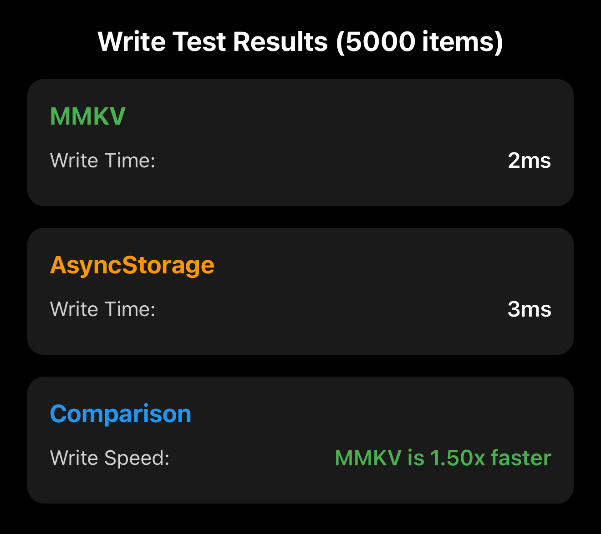
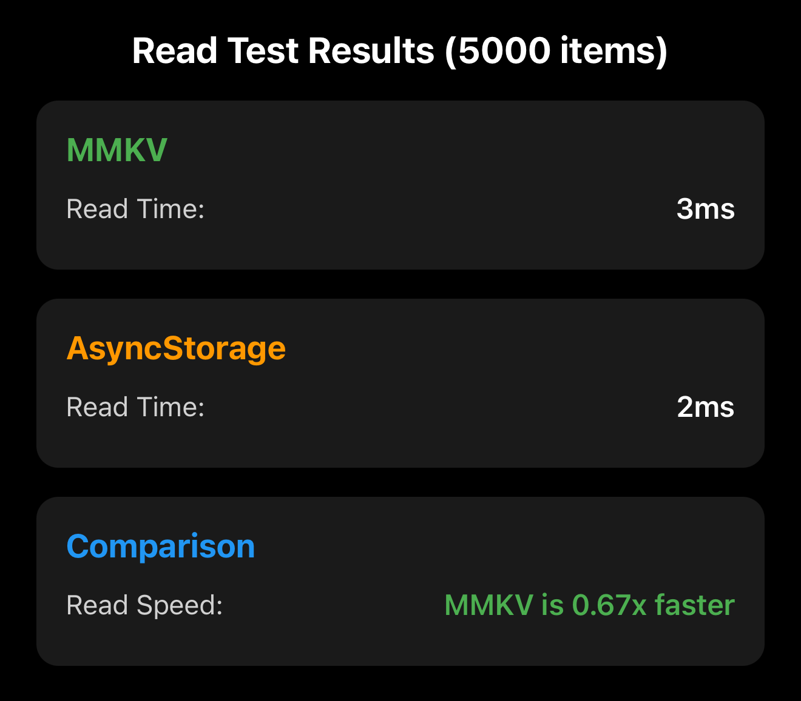

# MMKV vs AsyncStorage Performance Test

This is a [**React Native**](https://reactnative.dev) project, bootstrapped using [`@react-native-community/cli`](https://github.com/react-native-community/cli), that compares the performance of [React Native MMKV](https://github.com/mrousavy/react-native-mmkv) and [AsyncStorage](https://github.com/react-native-async-storage/async-storage) for read/write operations.

<div align="center">
  
  
</div>

## Performance Test Results (5000 items)

### Write Performance

- **MMKV**: 2ms
- **AsyncStorage**: 3ms
- **Result**: MMKV is **1.50x faster** for write operations

### Read Performance

- **MMKV**: 3ms
- **AsyncStorage**: 2ms
- **Result**: MMKV is **0.67x faster** (AsyncStorage is slightly faster for reads)

### Summary

The performance tests show that:

- MMKV excels at **write operations**, being 1.5x faster than AsyncStorage
- AsyncStorage performs slightly better at **read operations**
- Both libraries handle 5000 items in just a few milliseconds.

## Getting Started

### Prerequisites

- **Node.js**: v20.12.0 or higher (required for React Native 0.82+)
  - Check your version: `node --version`
  - If you need to upgrade, use [nvm](https://github.com/nvm-sh/nvm): `nvm install 20 --latest-npm`
- Make sure you have completed the [React Native environment setup](https://reactnative.dev/docs/set-up-your-environment).

### Installation

1. Clone the repository:

```sh
git clone <repository-url>
cd mmkv-vs-async_storage
```

2. Install dependencies:

```sh
npm install
# or
yarn install
```

3. Install iOS dependencies:

```sh
cd ios
pod install
cd ..
```

### Running the App

1. Start Metro bundler:

```sh
npm start
# or
yarn start
```

2. In a new terminal, run the app:

```sh
npm run ios
# or
yarn ios
```

## Troubleshooting

### Node.js Version Error

If you encounter the error `(0 , _util.styleText) is not a function` when running `npm start`, this means your Node.js version is too old. React Native 0.82+ requires Node.js v20.12.0 or higher.

**Solution:**
1. Check your Node.js version: `node --version`
2. If you're using nvm, upgrade to the latest Node.js 20: `nvm install 20 --latest-npm`
3. If you're not using nvm, download and install Node.js v20.12.0+ from [nodejs.org](https://nodejs.org/)

### iOS Build Error (Error Code 70)

If you encounter `error Failed to build ios project. "xcodebuild" exited with error code '70'` when running `npm run ios`, this is typically related to code signing or provisioning profile issues.

**Solution:**
1. Open the project in Xcode:
   ```sh
   open ios/MmkvTest.xcworkspace
   ```
2. In Xcode, select your project in the navigator
3. Go to the **Signing & Capabilities** tab
4. Select your **Team** and ensure a valid provisioning profile is configured
5. If building for a physical device, make sure your device is registered in your Apple Developer account
6. Try building and running directly from Xcode

For other issues, see the [React Native Troubleshooting](https://reactnative.dev/docs/troubleshooting) page.

## Learn More

- [React Native MMKV](https://github.com/mrousavy/react-native-mmkv)
- [React Native AsyncStorage](https://react-native-async-storage.github.io/async-storage/)
- [React Native Documentation](https://reactnative.dev)